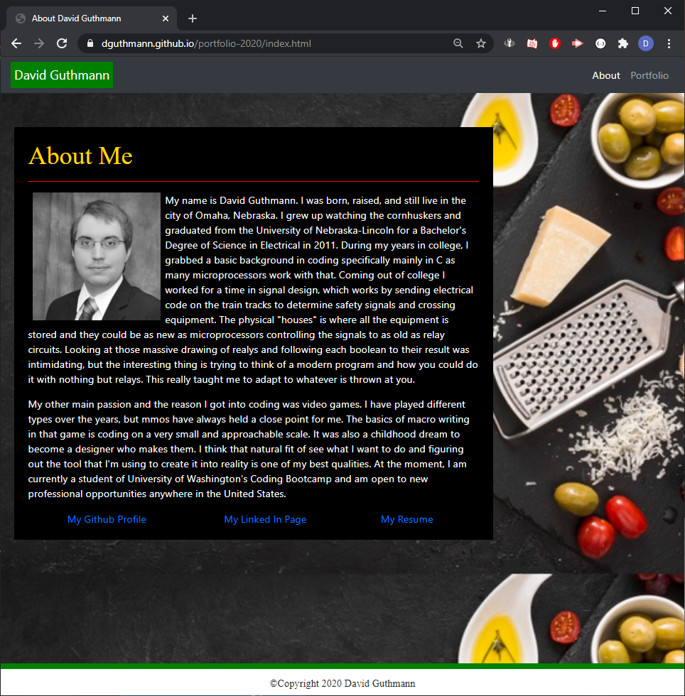
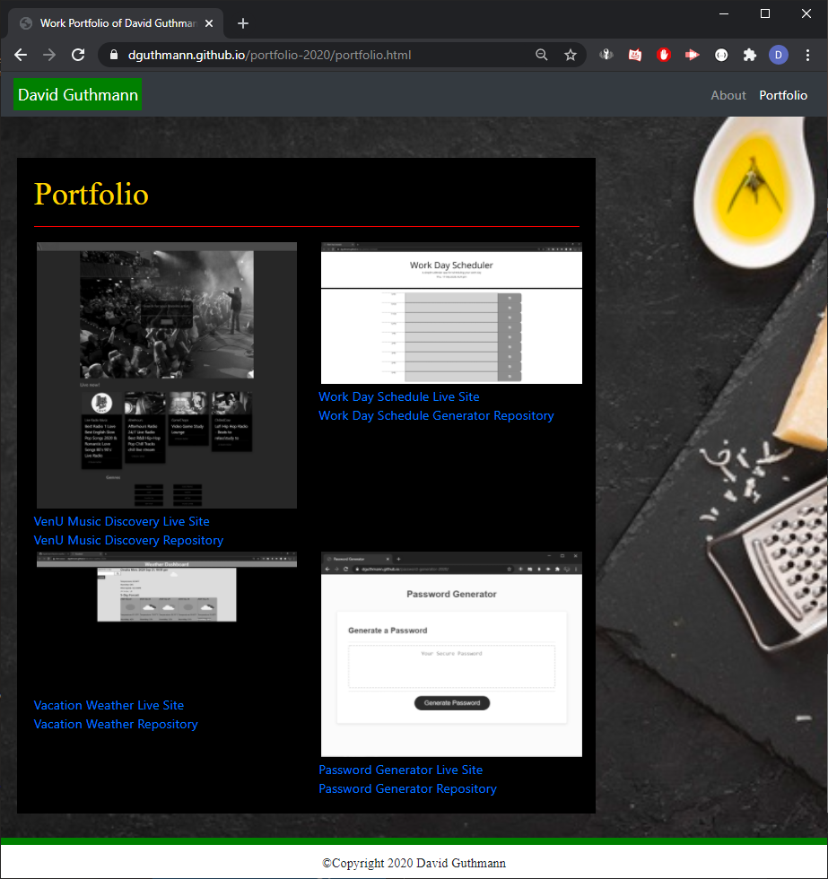

# portfolio-2020
### Author: David Guthmann

github: https://github.com/Dguthmann/  
livesite: https://dguthmann.github.io/first-portfolio/index.html

## List of Contents

index.html  
portfolio.html  
style.css  
README.md  
LICENSE   
DavidGuthmann-resume.pdf  
### images
dguthmann.png  
pwgss.png  
vacass.png  
venuss.png  
worscss.png  
screenshotindex.png  
screenshotport.png  

## Basic Overview of Project

This is an update to the first portfolio page I've created using html and css.  
It relies on a setup of two html files, with a base css styling all three of the html pages.  
The index is the base page, and can be used to include personal information of the user.  
The portfolio is a spot to contain images of projects the user creates, ideally adding on click links to said projects.  

## Screenshot of Website

  

## Resources Used

bootstrap for the javascript employed and some of the css  
http://www.cheeseipsum.co.uk/ for cheese ipsum  
Freepick.com for background cheese  

## Further Development Plans

Changing out projects for more complex and defining ones, altering how things are generated on page as knowledge increases

## Changelog

2020-09-29: Adding of personal information, links and screenshots of projects on the portfolio page, links to my github, linkedin, and a pdf of my resume  
2020-09-09: Addition of more comments to the file, and writing of README  
2020-09-08: Bug Fixing mainly of the footer, and the projects of the portfolio page staying within their container  
2020-09-07: Creation of files, the majority of coding, and first deployment